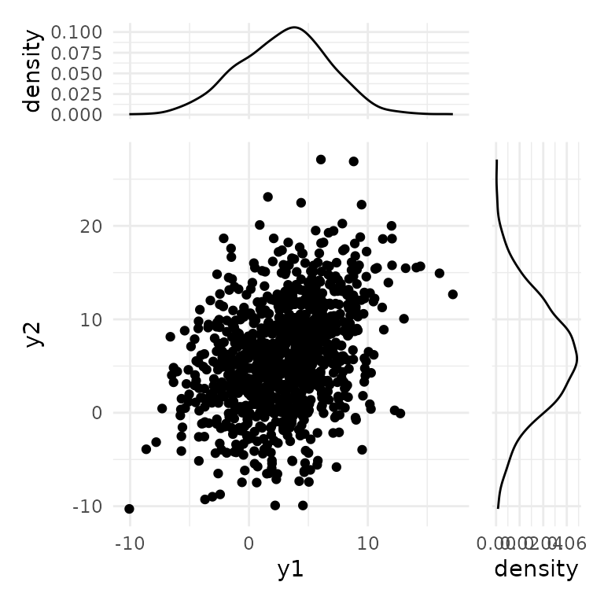
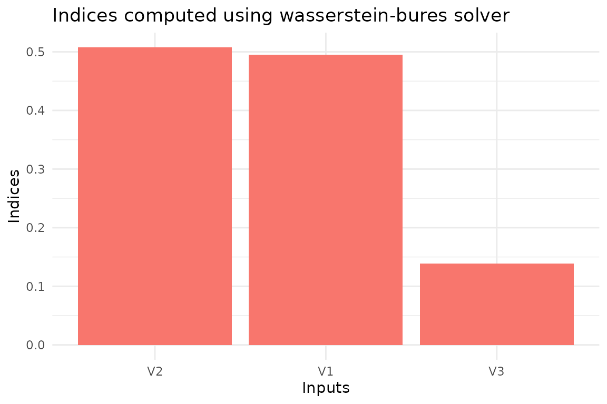
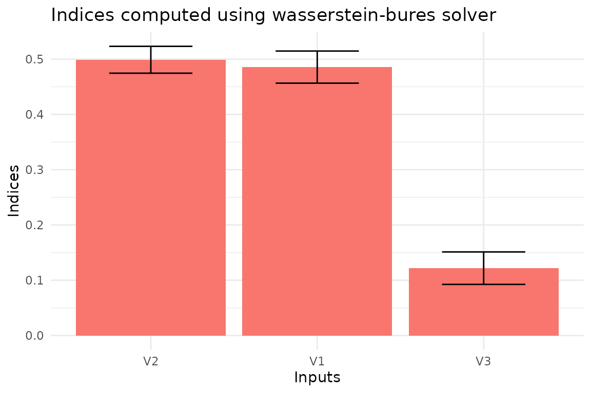

# Global Sensitivity Analysis of a simple Gaussian model

## Introduction

Global Sensitivity Analysis has the goal of breaking a mathematical
model’s tough rind, allowing us to look inside. Let’s assume that we are
modeling a problem where two quantities of interest,
$\mathbf{Y} = \{ Y_{1},Y_{2}\}$, are defined as a function of three
variables, $\mathbf{X} = \left( X_{1},X_{2},X_{3} \right)$. We express
this dependence through a linear transformation
$\mathbf{Y} = A\mathbf{X}$, where $$A = \begin{bmatrix}
4 & 2 & 3 \\
2 & 5 & {- 1}
\end{bmatrix}.$$ We assume that the inputs are uncertain and that this
uncertainty can be modeled using a multivariate normal distribution,
$\mathbf{X} \sim \mathcal{N}({\mathbf{μ}},\Sigma)$, with $\mu = (1,1,1)$
and $$\Sigma = \begin{bmatrix}
1 & 0.5 & 0.5 \\
0.5 & 1 & 0.5 \\
0.5 & 0.5 & 1
\end{bmatrix}.$$ To perform an uncertainty quantification of the model,
under the assumed distribution for the inputs, we can use a simple Monte
Carlo simulation. We generate the input sample (`x`), and we estimate
the model output (`y`) for each input. We can define the model and
simulate it in R using the following code block.

``` r
# Define the input distribution parameters
mx <- c(1, 1, 1)
Sigmax <- matrix(data = c(1, 0.5, 0.5, 0.5, 1, 0.5, 0.5, 0.5, 1), nrow = 3)

# Define the number of samples
N <- 1000

# Set the random number generator seed for reproducibility
set.seed(777)

# Sample from standard normals
x1 <- rnorm(N)
x2 <- rnorm(N)
x3 <- rnorm(N)

# Transform the standard normals into the required distribution
x <- cbind(x1, x2, x3)
x <- mx + x %*% chol(Sigmax)

# Define the model (matrix with coefficients)
A <- matrix(data = c(4, -2, 1, 2, 5, -1), nrow = 2, byrow = TRUE)

# Generate the output
y <- t(A %*% t(x))
colnames(y) <- c("y1", "y2")
```

We can plot the distribution of the output using the `ggplot2` package.

``` r
library(ggplot2)
library(patchwork)

# Set the theme
theme_set(theme_minimal())

# Prepare the marginal and the 2D density plots
p1 <- ggplot(as.data.frame(y), aes(x = y1, y = y2)) +
  geom_point(color = "black")
p2 <- ggplot(as.data.frame(y), aes(x = y1)) +
  geom_density()
p3 <- ggplot(as.data.frame(y), aes(x = y2)) +
  geom_density() +
  coord_flip()

p2 + plot_spacer() + p1 + p3 +
  plot_layout(ncol = 2, nrow = 2, widths = c(4, 1), heights = c(1, 4), axes = "collect")
```



## Sensitivity analysis

Given this uncertainty, we are interested in knowing which are the most
important inputs in the model. This is the goal the package `gsaot` has
been designed for. With this package, we can compute different indices
to evaluate the importance of the inputs on different statistical
properties of the output. Let’s first compute the Wasserstein-Bures
sensitivity indices. Since the inputs and outputs are gaussians, these
indices are the actual solution of the Optimal Transport problem .
However, this is not usually the case. The only hyperparameter needed in
this case is the number of partitions for the input data, `M`. We set
this value to 25 since we only have 1000 data points.

``` r
library(gsaot)

M <- 25
indices_wb <- ot_indices_wb(x, y, M)
indices_wb
#> Method: wass-bures 
#> 
#> Indices:
#>        V1        V2        V3 
#> 0.4951390 0.5072342 0.1387523 
#> 
#> Advective component:
#>        V1        V2        V3 
#> 0.3030834 0.3214758 0.1209107 
#> 
#> Diffusive component:
#>        V1        V2        V3 
#> 0.1920556 0.1857584 0.0178415
```

We can also use the package functions to create the plots for the
indices.

``` r
plot(indices_wb)
```



To estimate the uncertainty of the indices, we can use bootstrapping.
This is implemented in the function `ot_indices_wb` through the option
`boot = TRUE`. In this case, we also have to set the number of replicas
(`R`).

``` r
# Enable bootstrap
boot <- TRUE
# Set the number of replicas
R <- 100
# Define the confidence level
conf <- 0.99
# Define the type of confidence interval
type <- "norm"

# Compute the indices
indices_wb <- ot_indices_wb(x, y, M, 
                            boot = boot, R = R, conf = conf, type = type)
plot(indices_wb)
```


